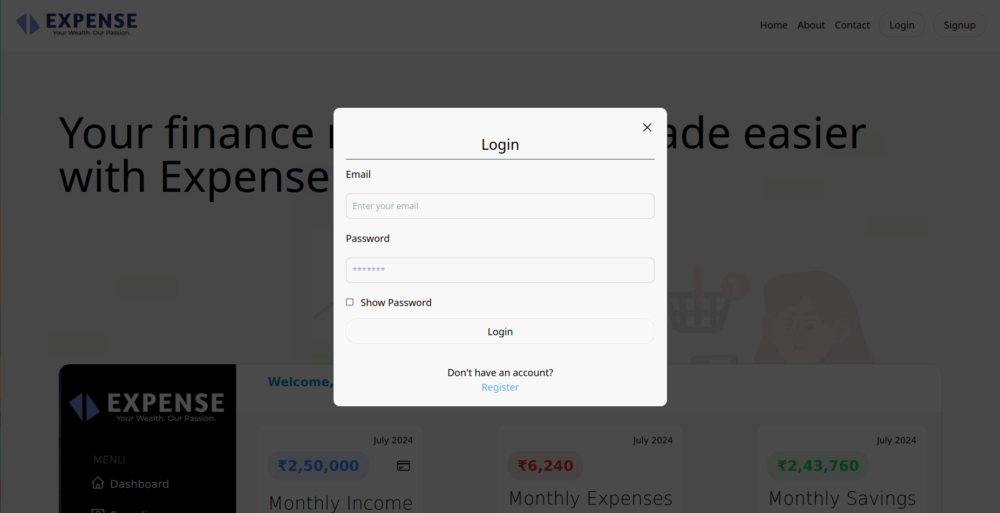
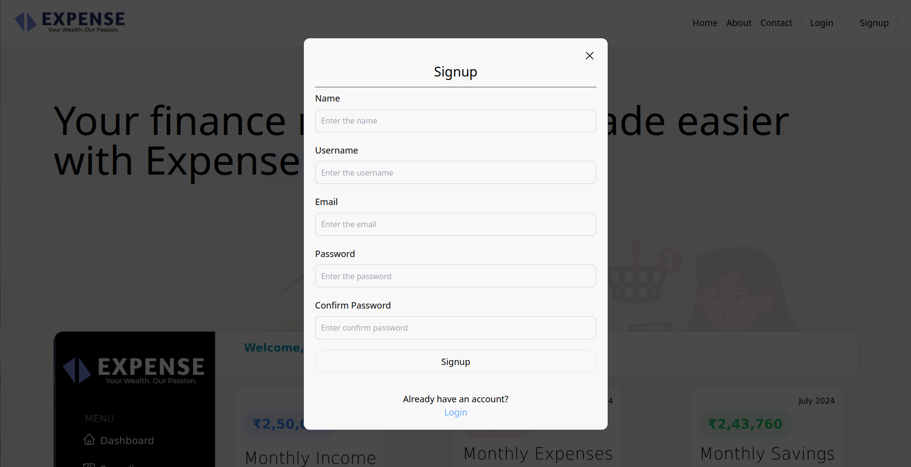
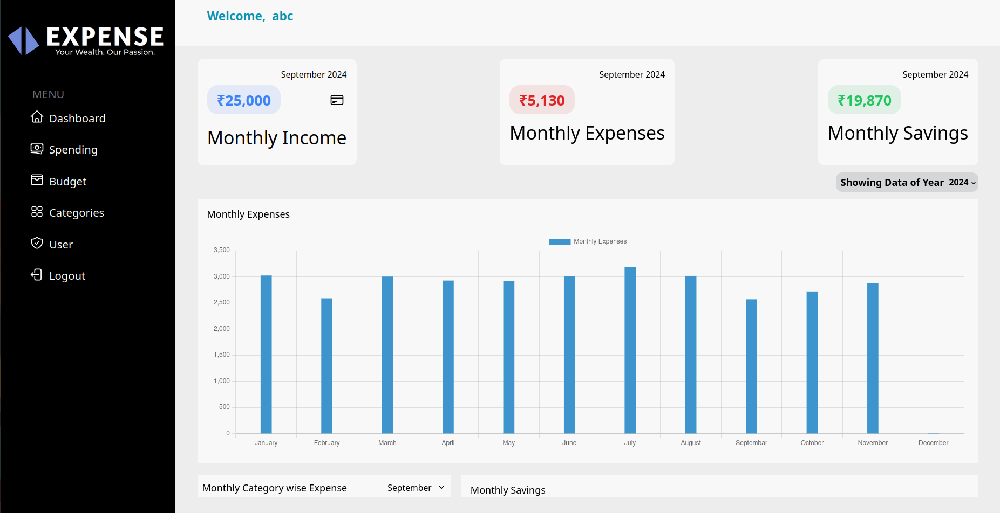
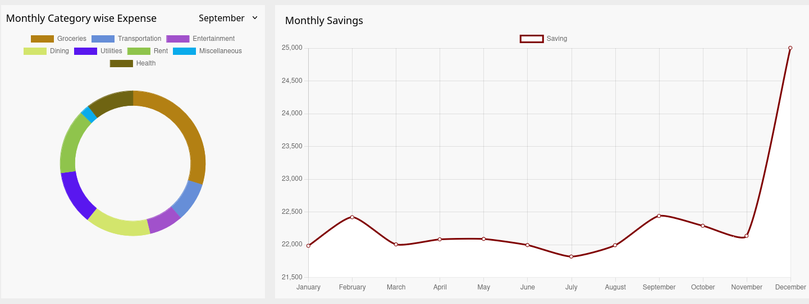
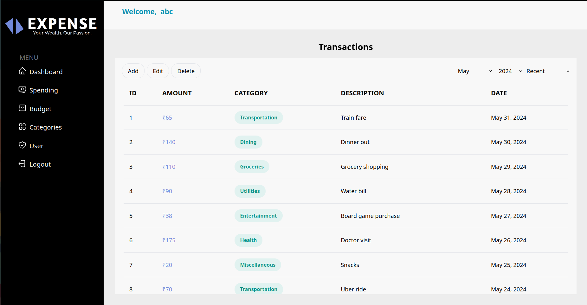
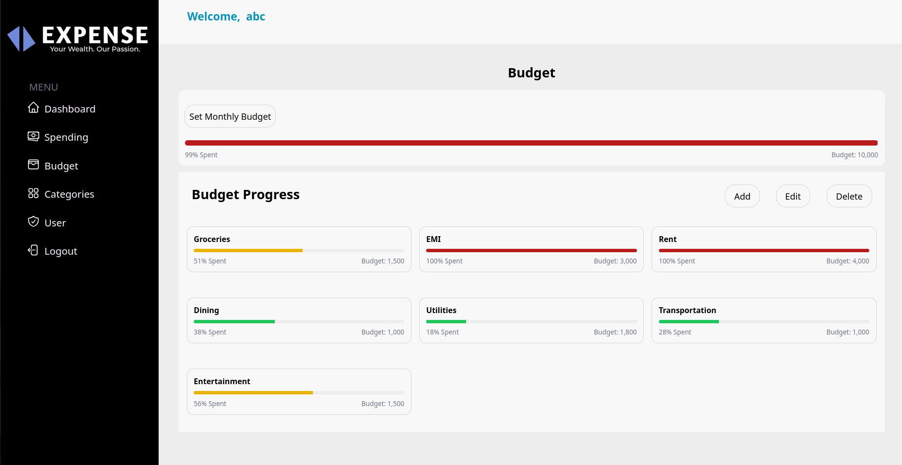
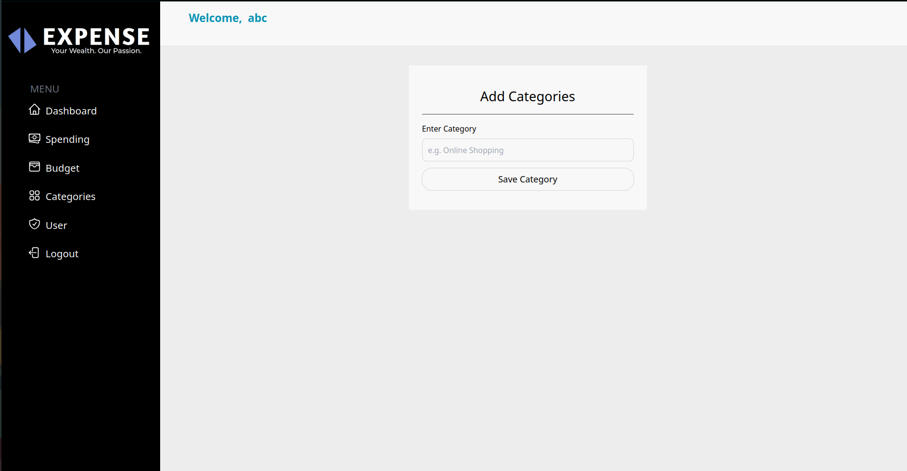
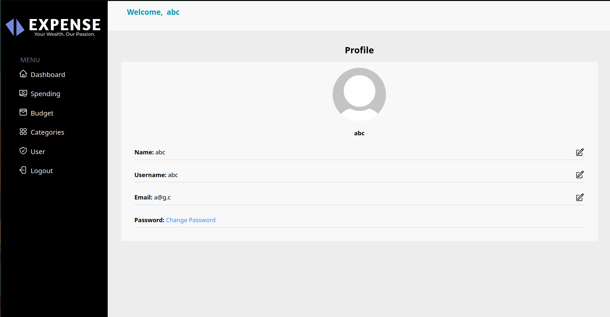

# Personal Expense Tracker 
[Demo Video](#demo.mp4)

A comprehensive application for tracking personal expenses, managing budgets, and analyzing spending habits.

## Table of Contents
- [Features](#features)
- [Screenshots](#screenshots)
- [Technologies Used](#technologies-used)
- [Getting Started](#getting-started)
- [Running the Application](#running-the-application)
- [Contributing](#contributing)
- [License](#license)

## Features
- User authentication (Login and Signup)
- Dashboard with financial overview
- Detailed spending tracker with sorting and filtering options
- Monthly budget setting and management
- Custom expense categories
- User profile management

## Screenshots

### Login

*Secure login interface for existing users*

### Signup

*User-friendly signup process for new account creation*

### Dashboard


*Comprehensive overview of financial status and recent transactions*

### Spending Tracker

*Detailed view of expenses with sorting and filtering options*

### Budget Management

*Set and track monthly budgets, including rollover from previous months*

### Categories

*Customize and manage expense categories*

### User Profile

*View and edit user details and preferences*

## Technologies Used
- **Backend:** Node.js, Express.js
- **Database:** PostgreSQL
- **Frontend:** React.js
- **Containerization:** Docker

## Getting Started

### Prerequisites
- Node.js and npm installed
- Docker and Docker Compose installed
- PostgreSQL (will be run in a Docker container)

### Installation

1. Clone the repository:
   ```bash
   git clone https://github.com/Niket-10/Expense.git
   ```

2. Navigate to the project directory:
   ```bash
   cd Expense
   ```

3. Install dependencies:
   ```bash
   npm install
   ```

## Running the Application

Follow these steps to run the Personal Expense Tracker:

1. Start the PostgreSQL database using Docker:
   ```bash
   docker-compose up
   ```
   Leave this terminal window open.

2. In a new terminal, navigate to the backend directory and start the server:
   ```bash
   cd backend
   npm run dev
   ```

3. Ensure PostgreSQL is running and accessible. In a new terminal:
   ```bash
   docker exec -it <container_name> psql -U <POSTGRES_USER>
   ```
   Replace `<container_name>` with your actual container name (you can press Tab for autocomplete) and `<POSTGRES_USER>` with the PostgreSQL username specified in your Docker configuration.

4. Once you've confirmed the database is running, you can exit the PostgreSQL prompt:
   ```sql
   \q
   ```

5. In a web browser, navigate to:
   ```
   http://localhost:3000
   ```

6. You should now see the Personal Expense Tracker application running. Sign up for a new account or log in with existing credentials to start using the app.

### Stopping the Application

1. To stop the backend server, press `Ctrl + C` in its terminal.
2. To stop the Docker containers, press `Ctrl + C` in the terminal where you ran `docker-compose up`, then run:
   ```bash
   docker-compose down
   ```

## Troubleshooting

- If you encounter any issues connecting to the database, ensure that the PostgreSQL container is running:
  ```bash
  docker ps
  ```
- Check the logs of the PostgreSQL container for any error messages:
  ```bash
  docker logs <container_name>
  ```

## Contributing

Contributions are welcome! Please feel free to submit a Pull Request.

## License

This project is licensed under the MIT License - see the [LICENSE](LICENSE) file for details.
